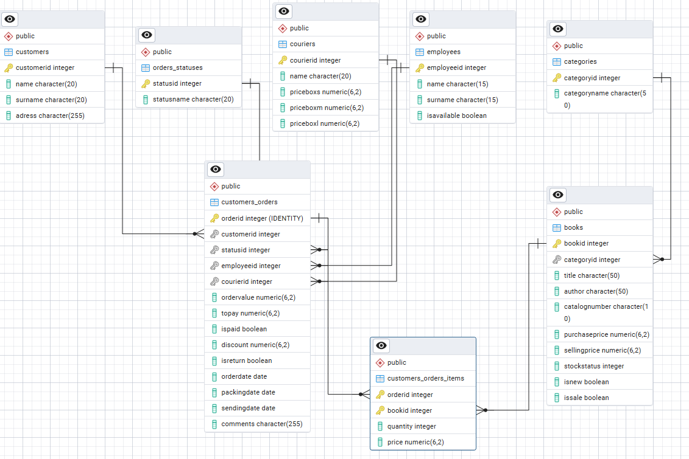

# PostgreSQL exercises in the world of the Lord of the Rings
## Hobbit Bookstore

Griffo Boffin runs its own bookstores in the Shire. He has a lot of customers and needs to make improvements to the bookstore. They decided to migrate their analog database to a digital relational database. Create an online store database in PostreSQL and deploy it to Ubuntu Server 22.04.



Diagram ERD for Hobbit Bookstore 


```sql
--Hobbit_Bookstore;

CREATE TABLE Categories (
CategoryId int,
CategoryName char(50) NOT NULL
);

CREATE TABLE Books (
BookId int,
CategoryId int,
Title char(50) NOT NULL,
Author char(50) NOT NULL,
CatalogNumber char(10),
PurchasePrice decimal(6,2),
SellingPrice decimal(6,2),
StockStatus int,
IsNew boolean,
IsSale boolean
);

CREATE TABLE Customers_Orders_Items (
OrderId int,
BookId int,
Quantity int,
Price decimal(6,2) DEFAULT 0
);

CREATE TABLE Customers (
CustomerId int,
Name char(20) NOT NULL,
Surname char(20) NOT NULL,
Adress char(255) NOT NULL
);

CREATE TABLE  Couriers (
CourierId int,
Name char(20) NOT NULL,
PriceBoxS decimal (6,2) NOT NULL,
PriceBoxM decimal (6,2) NOT NULL,
PriceBoxL decimal (6,2) NOT NULL
);

CREATE TABLE Orders_Statuses (
StatusId int,
StatusName char(20) NOT NULL
);

CREATE TABLE Customers_Orders (
OrderId int GENERATED ALWAYS AS IDENTITY (START WITH 1000),
CustomerId int,
StatusId int DEFAULT 1,
EmployeeId int,
CourierId int,
OrderValue decimal(6,2) DEFAULT 0,
ToPay decimal(6,2) DEFAULT 0,
IsPaid boolean DEFAULT false,
Discount decimal(6,2) DEFAULT 0,
IsReturn boolean DEFAULT false,
OrderDate  date DEFAULT CURRENT_DATE,
PackingDate date,
SendingDate date,
Comments char(255)DEFAULT null
);

CREATE TABLE Employees (
EmployeeId int,
Name char(15) NOT NULL,
Surname char(15) NOT NULL,
IsAvailable boolean
);

ALTER TABLE Categories ADD 
	CONSTRAINT PK_Categories PRIMARY KEY    
	(
		CategoryId
	)  
;

ALTER TABLE Books ADD 
	CONSTRAINT PK_Books PRIMARY KEY    
	(
		BookId
	)  
;

ALTER TABLE Customers_Orders_Items ADD 
	CONSTRAINT PK_Customers_Orders_Items PRIMARY KEY    
	(
		OrderId, BookId
	)  
;

ALTER TABLE Customers ADD 
	CONSTRAINT PK_Customers PRIMARY KEY    
	(
		CustomerId
	)  
;

ALTER TABLE Couriers ADD 
	CONSTRAINT PK_Couriers PRIMARY KEY    
	(
		CourierId
	)  
;

ALTER TABLE Orders_Statuses ADD 
	CONSTRAINT PK_Orders_Statuse PRIMARY KEY    
	(
		StatusId
	)  
;

ALTER TABLE Customers_Orders ADD 
	CONSTRAINT PK_Customers_Orders PRIMARY KEY    
	(
		OrderId
	)  
;

ALTER TABLE Employees ADD 
	CONSTRAINT PK_Employees PRIMARY KEY    
	(
		EmployeeId
	)  
;

ALTER TABLE Customers_Orders_Items 
ADD CONSTRAINT FK1_Customers_Orders_Items FOREIGN KEY 
	(
		OrderId
	) REFERENCES Customers_Orders (
		OrderId
	),
ADD CONSTRAINT FK2_Customers_Orders_Items FOREIGN KEY 
	(
		BookId
	) REFERENCES Books (
		BookId
	)
;

ALTER TABLE Books 
ADD CONSTRAINT FK1_Books FOREIGN KEY 
	(
		CategoryId
	) REFERENCES Categories (
		CategoryId
	)
;

ALTER TABLE Customers_Orders 
ADD CONSTRAINT FK1_Customers FOREIGN KEY 
	(
		CustomerId
	) REFERENCES Customers (
		CustomerId
	),
ADD CONSTRAINT FK2_Statuses FOREIGN KEY 
	(
		StatusId
	) REFERENCES Orders_Statuses (
		StatusId
	),
ADD CONSTRAINT FK3_Couriers FOREIGN KEY 
	(
		CourierId
	) REFERENCES Couriers (
		CourierId
	),
ADD CONSTRAINT FK4_Employees FOREIGN KEY 
	(
		EmployeeId
	) REFERENCES Employees (
		EmployeeId
	)
;

insert into Categories(CategoryId, CategoryName)
values 
(1, 'historical'),
(2, 'fantasy'),
(3, 'poetry'),
(4, 'novel'),
(5, 'natura')

insert into Orders_Statuses(StatusId, StatusName) 
values 
(1, 'pending'),
(2, 'processing'),
(3, 'shipped'),
(4, 'cancelled'),
(5, 'returned')

insert into Books(BookId, CategoryId, Title, Author, CatalogNumber, PurchasePrice, SellingPrice, StockStatus, IsNew, IsSale) 
values 
(1, 4, 'The History of the Shire', 'Hildigrim Took', 'HAN00001', 40.00, 45.00, 1, false, false),
(2, 2, 'Great Dragon', 'Fosco Baggins', 'HAN00001', 40.00, 45.00, 1, false, false),
(3, 5, 'Mushroom atlas', 'Belladonna Took', 'HAN00002', 40.00, 45.00, 1, false, false),
(4, 5, 'Herbal garden', 'Belladonna Took', 'HAN00003', 40.00, 45.00, 1, false, false),
(5, 1, 'Dzieje Shire', 'Esmeralda Hamgee', 'HAN00004', 40.00, 45.00, 1, false, false),
(6, 1, 'Mrok południa', 'Dudo Took', 'HAN00031', 30.00, 35.00, 1, false, false),
(7, 1, 'Dobre czasy', 'Lily Grubb', 'HAN00034', 20.00, 25.00, 1, false, false),
(8, 1, 'Historia Hobbitów', 'Bingo Took', 'HAN00032', 40.00, 45.00, 1, false, false),
(9, 5, 'Wielki zielnik', 'Daisy Took', 'HAN00043', 43.00, 47.00, 1, false, false),
(10, 5, 'Porady zielarskie', 'Daisy Took', 'HAN00061', 30.00, 35.00, 1, false, false)

insert into Couriers(CourierId, Name, PriceBoxS, PriceBoxM,PriceBoxL)
values 
(1, 'Fast rabbit', 8.00, 10.00, 12.00),
(2, 'Fox', 8.00, 10.00, 12.00),
(3, 'Ostrich', 8.00, 10.00, 12.00)

insert into Customers(CustomerId, Name, Surname, Adress)
values 
(1, 'Lily', 'Baggins','Green Fields 12, Nobottle'),
(2, 'Marigold', 'Brandybuck','Sunny Fields 5, Hobbiton'),
(3, 'Ivy', 'Greenhand','Secluded Hills 4, Woodhall'),
(4, 'Dudo', 'Boffin','Blackberry Glade 5, Hobbiton'),
(5, 'Melitot', 'Brown','Fragrant Orchard 6, Greenwell'),
(6, 'Belladonna', 'Hornblower','Stone Circles 8, Overhill'),
(7, 'Folco', 'Proudneck','Misty Brook 6, Woodhall'),
(8, 'Hugo', 'Goodbarrel','Straw Glade 12, Budgeford'),
(9, 'Samwise', 'Stumpwillow','Oak Alley 3, Bywater'),
(10, 'Merry', 'Proudroot','Blueberry Glade 14, Hobbiton')

insert into Employees(EmployeeId, Name, Surname, IsAvailable)
values 
(1, 'Rosie Cotton', 'Cotton', true),
(2, 'Gaf', 'Gamgee', false),
(3, 'Halfo', 'Stumpwillow', true),
(4, 'Mentha', 'Brownwhistle', false)

--Trigger function after INSERT (placing an order)

CREATE OR REPLACE FUNCTION update_total_amount_after_insert()
RETURNS TRIGGER AS $$
BEGIN
    UPDATE Customers_Orders
    SET OrderValue = (
        SELECT COALESCE(SUM(Quantity * Price), 0)
        FROM Customers_Orders_Items
        WHERE OrderId = NEW.OrderId
    )
    WHERE OrderId = NEW.OrderId;

    RETURN NULL;
END;
$$ LANGUAGE plpgsql;

--Trigger after INSERT

CREATE OR REPLACE TRIGGER trg_update_total_amount_after_insert
AFTER INSERT ON Customers_Orders_Items
FOR EACH ROW
EXECUTE FUNCTION update_total_amount_after_insert();

--Trigger function after UPDATE (order edit)

CREATE OR REPLACE FUNCTION update_total_amount_after_update()
RETURNS TRIGGER AS $$
BEGIN
    UPDATE Customers_Orders
    SET OrderValue = (
        SELECT COALESCE(SUM(Quantity * Price), 0)
        FROM Customers_Orders_Items
        WHERE OrderId = NEW.OrderId
    )
    WHERE OrderId = NEW.OrderId;

    RETURN NEW;
END;
$$ LANGUAGE plpgsql;

--Trigger after UPDATE

CREATE OR REPLACE TRIGGER trg_update_total_amount_after_update
AFTER UPDATE ON Customers_Orders_Items
FOR EACH ROW
EXECUTE FUNCTION update_total_amount_after_update();


--Trigger function after DELETE (removing a book from the order)

CREATE OR REPLACE FUNCTION update_total_amount_after_delete()
RETURNS TRIGGER AS $$
BEGIN
    UPDATE Customers_Orders
    SET OrderValue = (
        SELECT COALESCE(SUM(Quantity * Price), 0)
        FROM Customers_Orders_Items
        WHERE OrderId = OLD.OrderId
    )
    WHERE OrderId = OLD.OrderId;

    RETURN OLD;
END;
$$ LANGUAGE plpgsql;

--Trigger after DELETE

CREATE OR REPLACE TRIGGER trg_update_total_amount_after_delete
AFTER DELETE ON Customers_Orders_Items
FOR EACH ROW
EXECUTE FUNCTION update_total_amount_after_delete();

--A customer places an order in a bookstore 

WITH new_order AS (
    insert into Customers_Orders(CustomerId, EmployeeId, CourierId)
	values
	(1, 1, 1)
    RETURNING OrderId
)
insert into Customers_Orders_Items (OrderId, BookId, Quantity, Price)
select OrderId, book, quantity, price from new_order,
(VALUES
(1, 1, 40),
(2, 1, 50),
(3, 3, 45)
) AS product (book, quantity , price)

-- Testing the operation of triggers
SELECT * FROM Customers_Orders
SELECT * FROM Customers_Orders_Items
UPDATE Customers_Orders_Items SET quantity = 3 WHERE bookid = 2
DELETE FROM Customers_Orders_Items WHERE bookid = 1

-- Adding 10000 random orders
DO $$
DECLARE
    i INT := 1;
BEGIN
    WHILE i <= 10000 LOOP
		WITH new_order AS (
    insert into Customers_Orders(CustomerId, EmployeeId, CourierId)
	values(
	FLOOR(RANDOM() * 10 + 1)::INT, 
	FLOOR(RANDOM() * 4 + 1)::INT, 
	FLOOR(RANDOM() * 3 + 1)::INT
	)
    RETURNING OrderId
)
insert into Customers_Orders_Items (OrderId, BookId, Quantity, Price)
select OrderId, book, quantity, price from new_order,
(VALUES
	(FLOOR(RANDOM() * 10 + 1)::INT, FLOOR(RANDOM() * 4 + 1)::INT, ROUND(FLOOR(RANDOM() * 21 + 40)::NUMERIC, 2))
) AS product (book, quantity , price);
        i := i + 1;
    END LOOP;
END$$;

-- How many orders have been placed?
SELECT COUNT(*) FROM Customers_Orders;
-- What is the average order (accuracy two decimal places)?
SELECT ROUND(AVG(OrderValue),2) FROM Customers_Orders;
--  Hobbit with which ID placed the most orders and how many??
SELECT
    CustomerId,
    COUNT(*) AS orders
FROM
    Customers_Orders
GROUP BY
    CustomerId
ORDER BY
    orders DESC
LIMIT 1;
```


